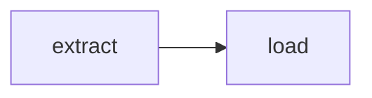

# Local Testing

Test polyris pipelines locally without deploying to AWS.

## Quick Start

```python
from polyris import DAG, task
from polyris.local import validate, dry_run, run

# Define your pipeline
with DAG("my-pipeline", schedule="@daily") as dag:
    @task.sfn(arn="arn:aws:states:...")
    def extract(): pass
    
    @task.sfn(arn="arn:aws:states:...")
    def load(): pass
    
    extract() >> load()

# Test it!
validate(dag)
dry_run(dag)
run(dag, mock=True)
```

## Available Functions

### 1. `validate(dag)` - Check DAG Structure

Validates:
- DAG has tasks
- No circular dependencies
- All task dependencies exist
- Generated ASL is valid
- Alerts are configured

```python
from polyris.local import validate

result = validate(dag)
# Returns: {'valid': True, 'errors': [], 'warnings': [], 'info': {...}}
```

**Output:**
```
🔍 Validating DAG: my-pipeline
   Schedule: @daily
   Tasks: 2

✅ Validation passed!
```

### 2. `dry_run(dag)` - Preview Execution

Shows what would happen without executing:

```python
from polyris.local import dry_run

dry_run(dag)
dry_run(dag, show_asl=True)     # Also show Step Functions JSON
dry_run(dag, show_mermaid=True) # Show Mermaid diagram (default)
```

**Output:**
```
============================================================
🚀 DRY RUN: my-pipeline
============================================================

📋 DAG Configuration:
   ID: my-pipeline
   Schedule: @daily
   Alerts: {'slack': '#alerts'}

📝 Execution Order:
   1. extract
      Type: sfn
      ARN: arn:aws:states:...
   2. load (after: extract)
      Type: sfn
      ARN: arn:aws:states:...

📊 DAG Diagram (Mermaid):


🔍 Validation:
   ✅ All checks passed

============================================================
ℹ️  This is a dry run. No resources were created or modified.
============================================================
```

### 3. `run(dag, mock=True)` - Mock Execution

Simulates pipeline execution locally:

```python
from polyris.local import run

# Simple mock
result = run(dag, mock=True)
print(result.summary())

# With custom mock responses
result = run(dag, mock=True, task_mocks={
    'extract': {'records': 100},
    'transform': {'records': 95},
})

# With callbacks
def on_start(task_id):
    print(f"Starting: {task_id}")

def on_complete(result):
    print(f"Completed: {result.task_id} - {result.status}")

result = run(dag, mock=True, on_task_start=on_start, on_task_complete=on_complete)
```

**Output:**
```
============================================================
🧪 MOCK EXECUTION: my-pipeline
============================================================

▶️  Running: extract
   ✅ Success (102ms)
▶️  Running: load
   ✅ Success (101ms)

============================================================
📊 Result: ✅ 2 succeeded, ❌ 0 failed, ⏭️ 0 skipped
⏱️  Duration: 210ms
============================================================
```

### 4. `run(dag, localstack=True)` - LocalStack Execution

Run against real AWS emulator:

```bash
# Start LocalStack
docker run -d -p 4566:4566 localstack/localstack
```

```python
from polyris.local import run

result = run(dag, localstack=True)
# or with custom endpoint:
result = run(dag, localstack=True, localstack_endpoint="http://localhost:4566")
```

**Output:**
```
============================================================
🐳 LOCALSTACK EXECUTION: my-pipeline
   Endpoint: http://localhost:4566
============================================================

✓ Created state machine: local-my-pipeline
✓ Started execution: arn:aws:states:us-east-1:000000000000:execution:...
   ⏳ Status: RUNNING
   ⏳ Status: RUNNING
✓ Execution completed: SUCCEEDED

📊 Result: ✅ 2 succeeded
============================================================
```

## ExecutionResult

All `run()` calls return an `ExecutionResult` object:

```python
result = run(dag, mock=True)

# Properties
result.dag_id         # 'my-pipeline'
result.status         # 'success', 'failed', or 'partial'
result.start_time     # datetime
result.end_time       # datetime
result.duration_ms    # 210
result.task_results   # List[TaskResult]

# Methods
result.summary()      # '✅ 2 succeeded, ❌ 0 failed, ⏭️ 0 skipped'

# Iterate task results
for task in result.task_results:
    print(f"{task.task_id}: {task.status} ({task.duration_ms}ms)")
    if task.output:
        print(f"  Output: {task.output}")
    if task.error:
        print(f"  Error: {task.error}")
```

## Trigger Rules

Mock execution respects trigger rules:

```python
with DAG("pipeline", ...) as dag:
    @task.sfn(arn="...")
    def extract(): pass
    
    @task.sfn(arn="...", trigger_rule="all_done")  # Runs even if extract fails
    def cleanup(): pass
    
    extract() >> cleanup()

# Mock with failure
result = run(dag, mock=True, task_mocks={
    'extract': Exception("Simulated failure"),
})
# cleanup still runs because trigger_rule="all_done"
```

> **This mock behavior does not carry over to the real deployed pipeline yet.**
> `run(dag, mock=True)` is a plain Python loop — it has no equivalent of the deployed
> pipeline's `Parallel`-based execution or its intervention-first pause on failure
> (ADR #114), so it always continues past a failed task. In the real deployed
> pipeline, a failure pauses for a human decision first; `all_done` reacting to a
> *resolved* failure (rather than running only on the success path) is a planned,
> scoped exception (ADR #116) that hasn't shipped yet. Don't take a green mock test
> for `all_done`-on-failure as proof the same cleanup will fire in production today —
> see `docs/features/DSL.md#trigger-rules` for what's currently reliable.

## Testing Pattern

Recommended test structure:

```python
# tests/test_my_pipeline.py
import pytest
from my_pipeline import dag
from polyris.local import validate, dry_run, run

class TestMyPipeline:
    def test_validation(self):
        result = validate(dag, verbose=False)
        assert result['valid'] is True
        assert len(result['errors']) == 0
    
    def test_dry_run(self):
        # Should not raise
        dry_run(dag)
    
    def test_mock_execution(self):
        result = run(dag, mock=True)
        assert result.status == 'success'
        assert len(result.task_results) == 2
    
    def test_with_custom_mocks(self):
        result = run(dag, mock=True, task_mocks={
            'extract': {'records': 100},
        })
        extract_result = next(r for r in result.task_results if r.task_id == 'extract')
        assert extract_result.output == {'records': 100}
```

Run tests:
```bash
pytest tests/test_my_pipeline.py -v
```

## Tips

1. **Always validate before deploy**: Add `validate(dag)` to your pipeline file
2. **Use dry_run for debugging**: See exact execution order and ASL
3. **Mock complex logic**: Use `task_mocks` to simulate external service responses
4. **LocalStack for integration tests**: Test actual Step Functions behavior
5. **Check trigger rules**: Mock failures to verify cleanup tasks run correctly
